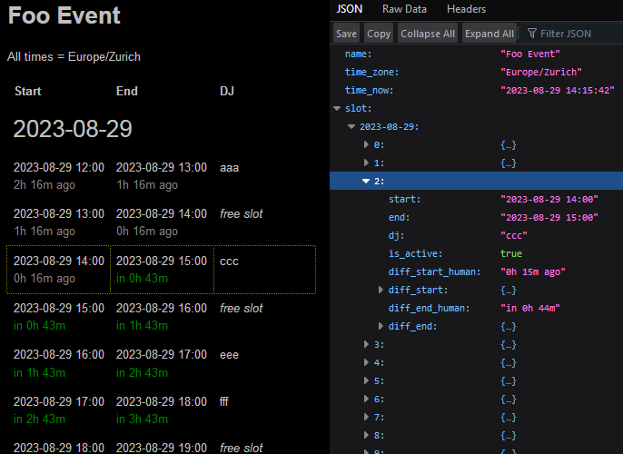

# RaidTrain

Quickly create a time slot overview webpage for your Twitch raid train event and such activities.

---

## Dependencies

- [PHP](https://php.net) `>= 8.1.20`
- [Webserver](https://en.wikipedia.org/wiki/Web_server)

---

## Motivation

The purpose is to present a list of event times in the event timezone. Users will be relieved from the task of manually converting these times to their current timezones in order to comprehend when a particular time slot begins. This approach eliminates the need for users to actively select or be aware of their specific timezones.  
Additionally, it should be easy for administrators to create/update the time slots. Refer to the **Slots Data File** section below for more details on creating and updating these time slots.

Example screenshot:  


---

## Slots Data File

Create a new text file. **Enter one time slot per line**, the format is:

```text
start timestamp | end timestamp | dj name or empty if slot is free
```

```text
YYYY-MM-DD HH:MM | YYYY-MM-DD HH:MM | Any Text or Empty
```

Example:

```text
2023-08-27 20:00 | 2023-08-27 21:00 | DJ Flash
2023-08-27 22:00 | 2023-08-27 23:00 | DJ Bang
2023-08-27 23:00 | 2023-08-28 00:00 | DJ Boom
2023-08-28 00:00 | 2023-08-28 01:00 | DJ Mega
2023-08-28 01:00 | 2023-08-28 02:00 | DJ Fire
```

**Enter times in the 24-clock format**. Remember that `00:00` means "start of the day" and therefore it'll be the next day - see:

```text
2023-08-27 23:00 | 2023-08-28 00:00 | DJ Boom
```

**Further...**

- Lines that are empty or start with `#` are ignored so you can add notes.
- You can leave the DJ name empty after the last separator (`|`) in case the slot is still free to take.
- Lines that have not 3 parts - or in other words - are not 2 separators (`|`), are ignored.

---

## Basic Usage

There are two functional examples to read through and try out:
- [usage-html-output.php](./example/usage-html-output.php)
- [usage-json-output.php](./example/usage-json-output.php)


Here's a rundown of the very basics:


```php
// Require/include the class file
require './raidtrain.php';

// Optionally aliasing the class so we don't have to refer to it as \org\etrusci\raidtrain\RaidTrain
use org\etrusci\raidtrain\RaidTrain;

// Init the class
$App = new RaidTrain(
    name: 'My Event', # name of your event
    time_zone: 'America/New_York', # for valid timezone values see https://www.php.net/manual/en/timezones.php
    slot_file: '/path/to/slot.txt', # see "slots" topic below
);

// Get the event data as array (default)
$event = $App->get_event_data();

// Or as JSON
// $event = $App->get_event_data(as_json: true);

// Do something with $event ...
```

The event data will have the following structure:

```json
{
    "name": "Foo Event",
    "time_zone": "Europe/Zurich",
    "time_now": "2023-08-29 00:27:33",
    "slot": {
        "2023-08-29": [
            {
                "start": "2023-08-29 12:00",
                "end": "2023-08-29 13:00",
                "dj": "aaa",
                "is_active": false,
                "diff_start_human": "in 11h 32m",
                "diff_start": {
                    "d": 0,
                    "h": 11,
                    "m": 32,
                    "s": 26,
                    "is_past": false
                },
                "diff_end_human": "in 12h 32m",
                "diff_end": {
                    "d": 0,
                    "h": 12,
                    "m": 32,
                    "s": 26,
                    "is_past": false
                }
            },
            {
                "start": "2023-08-29 14:00",
                "end": "2023-08-29 15:00",
                "dj": "ccc",
                "is_active": false,
                "diff_start_human": "in 13h 32m",
                "diff_start": {
                    "d": 0,
                    "h": 13,
                    "m": 32,
                    "s": 26,
                    "is_past": false
                },
                "diff_end_human": "in 14h 32m",
                "diff_end": {
                    "d": 0,
                    "h": 14,
                    "m": 32,
                    "s": 26,
                    "is_past": false
                }
            },
            {
                "start": "2023-08-29 15:00",
                "end": "2023-08-29 16:00",
                "dj": null,
                "is_active": false,
                "diff_start_human": "in 14h 32m",
                "diff_start": {
                    "d": 0,
                    "h": 14,
                    "m": 32,
                    "s": 26,
                    "is_past": false
                },
                "diff_end_human": "in 15h 32m",
                "diff_end": {
                    "d": 0,
                    "h": 15,
                    "m": 32,
                    "s": 26,
                    "is_past": false
                }
            }
        ],
        "2023-08-30": [
            {
                "start": "2023-08-30 00:00",
                "end": "2023-08-30 01:00",
                "dj": null,
                "is_active": false,
                "diff_start_human": "in 23h 32m",
                "diff_start": {
                    "d": 0,
                    "h": 23,
                    "m": 32,
                    "s": 26,
                    "is_past": false
                },
                "diff_end_human": "in 1d 0h 32m",
                "diff_end": {
                    "d": 1,
                    "h": 0,
                    "m": 32,
                    "s": 26,
                    "is_past": false
                }
            },
            {
                "start": "2023-08-30 01:00",
                "end": "2023-08-30 02:00",
                "dj": "lll",
                "is_active": false,
                "diff_start_human": "in 1d 0h 32m",
                "diff_start": {
                    "d": 1,
                    "h": 0,
                    "m": 32,
                    "s": 26,
                    "is_past": false
                },
                "diff_end_human": "in 1d 1h 32m",
                "diff_end": {
                    "d": 1,
                    "h": 1,
                    "m": 32,
                    "s": 26,
                    "is_past": false
                }
            }
        ]
    }
}
```

---

## God Mode aka Admin

The **godmode.php** file is really just a dirty example. It let's you edit the slots data file on the web.  
If you want to use it, copy **.godmode-pw-example** and rename it to **.godmode-pw**. The example password that should already be in there, is `123`.

Create your own password hash with either [my genhash tool](https://etrusci.org/tool/genhash) or PHP:

```php
$myhash = password_hash(password: 'YOUR PASSWORD HERE', algo: PASSWORD_DEFAULT);
print($myhash);
```

You should store **.godmode-pw** outside of the public webroot of your webserver.

The slots file must be readable+writable by the webserver process.

Also don't forget to adjust the `SLOT_FILE` and `PW_FILE` paths in **godmode.php**.

---

## License

Public Domain Worldwide
